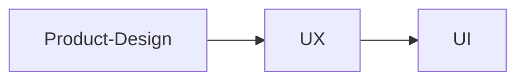

# Figma UI Design By Asif Shah

## Class 01 - 2023/02/05

- [Video Lecture](https://www.youtube.com/live/zkFerNEVvtY?feature=share)

### Class Notes

- Design

  - The latin word "designare" comes in late 14c., which is a composite of de 'out' + signare 'to mark, shape', 'make out', 'point out'
  - Design is to design a design to produce a design
  - Design is communication. Just like a writer or a speaker chooses thrie words to communicate a message, good designers choose the right visual elements to also communicate a message. The larger goal and message for the design and effectively communcating that message is what makes good design. 'good'.

- Design Categories

  - communication
  - graphic
  - web
  - information
  - interaction
  - interface
  - software
  - typographic
  - ux
  - game
  - architecture
  - product
  - social
  - educational
  - industrial
  - engineering
  - interior
  - environmental
  - experiance
  - emotional
  - service
  - sound
  - editorial

- Design as a language

  - concept
  - components
  - composition

- Concept

  - conveyance
  - theme
  - process
  - evaluation

- Components

  - Tools
  - Line/Shape
  - Forms
  - Colors/Value
  - Texture
  - Size
  - Images
  - Typography

- Composition
  - Placement/Division
  - Grouping
  - Harmony
  - Ephasis
  - Alignment
  - Flow
